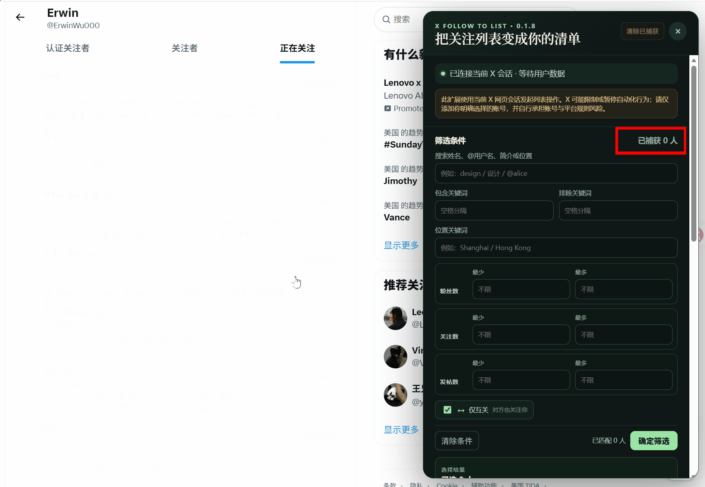
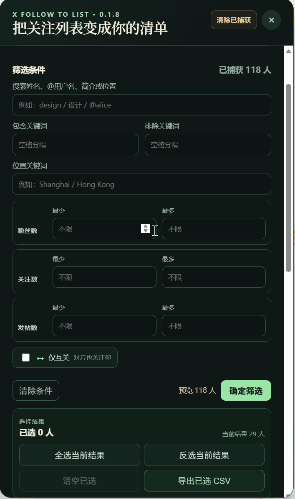
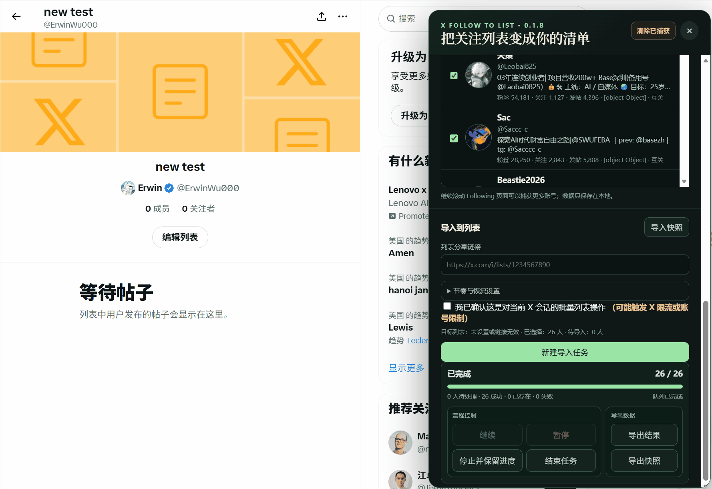

# X Follow to List

**Filter your Following and bulk add selected accounts to any X/Twitter List**  
Free local extension for Chrome and Edge. No API key, no server, all data stays in your browser.

## Usage Demo / 使用演示

### 1. 获取关注列表 / Get your following list

  

### 2. 筛选账号 / Filter accounts

  

### 3. 上传到列表 / Add accounts to your list

  

[English](#english) | [中文](#中文) | [Privacy Policy / 隐私政策](PRIVACY.md)

---

## English

### Overview
X Follow to List is a Chrome extension that helps you efficiently manage your X (Twitter) Lists. It automatically captures accounts from your **Following** page, lets you apply powerful filters, and bulk-adds selected accounts to any List with smart rate limiting.

### ✨ Features
- **Smart Capture** — Automatically collects accounts while scrolling your Following page (only real follows, no recommendations mixed in)
- **Advanced Filtering** — Filter by keywords (include/exclude), follower count, following count, posts count, location, mutual follow, and more
- **Easy Selection** — Select all, invert selection, or pick individually. Export selected accounts as CSV
- **Bulk Add to List** — Paste any List share link and add accounts in batches with random delays
- **Task Management** — Pause/resume, batch waiting, snapshot export/import, history tracking
- **Privacy First** — Everything runs locally in your browser. No data is sent anywhere

### Quick Start
1. Download the latest release or clone this repo
2. Go to `chrome://extensions/` (or Edge equivalent)
3. Enable **Developer mode** → **Load unpacked** → Select the `extension-dist` folder
4. Open your Following page (`https://x.com/yourusername/following`)
5. Click the extension icon to open the panel

### How to Use
1. Scroll down on your Following page to capture accounts
2. Use the filter panel to narrow down results
3. Select the accounts you want
4. Go to your target List, copy its share link, and paste it in the panel
5. Adjust rate settings if needed, confirm, and start importing

### Task Recovery & Safety
- Tasks can be paused and resumed later
- Use **Export Snapshot** to save progress and restore on another browser
- Built-in delays and batch limits help avoid rate limits
- The extension respects X’s limits and will pause when needed

### Notes & Warnings
- **Safe Bulk Operation**: For safety, limit to **200–300 adds per day**. Use random intervals (3–8 seconds). Start with small test batches (e.g. 10–20 accounts) before scaling up.
- Each List can have a maximum of 5,000 members
- Bulk operations carry some risk of rate limiting or temporary restrictions — use responsibly
- All data is stored locally in your browser extension storage
- Clear browser data or uninstalling the extension will remove local tasks (export snapshots first)
- This is an independent, unofficial tool and is not affiliated with or endorsed by X Corp.

---

## 中文

### 项目概述
**X Follow to List** 是一个免费的 Chrome 扩展，帮助你在 X（Twitter）上高效管理列表。  
它可以自动捕获你「正在关注」页面中的账号，支持多条件筛选，并一键批量添加到任意列表。

### ✨ 主要功能
- **智能捕获**：在 Following 页面滚动时自动收集真实关注账号（不会混入推荐账号）
- **强大筛选**：支持关键词（包含/排除）、粉丝数、关注数、发帖数、位置、仅互关等多种条件
- **灵活选择**：全选、反选、单个勾选，支持导出已选账号为 CSV
- **批量导入列表**：粘贴列表分享链接，带随机间隔批量添加
- **任务管理**：支持暂停/继续、批次等待、快照导出/导入、历史记录
- **隐私安全**：所有数据和操作均在浏览器本地完成，无需 API Key

### 快速开始
1. 下载最新 Release 或克隆本仓库
2. 打开 `chrome://extensions/`（或 Edge 对应页面）
3. 开启「开发者模式」→ 点击「加载已解压的扩展程序」→ 选择 `extension-dist` 文件夹
4. 打开你的 Following 页面（如 `https://x.com/你的用户名/following`）
5. 点击浏览器右上角扩展图标打开面板

### 使用流程
1. 在 Following 页面向下滚动捕获账号
2. 使用筛选面板设置条件并点击「确定筛选」
3. 勾选需要添加的账号
4. 打开目标列表，复制分享链接并粘贴到面板
5. 调整速率设置，确认后开始导入

### 任务恢复与安全
- 支持随时暂停和继续任务
- 可使用「导出快照」保存进度，在其他浏览器恢复
- 内置随机延时和批次限制，帮助避免触发限流
- 遇到限流时会自动暂停并提示

### 注意事项
- **安全批量操作建议**：为降低封号风险，建议每天添加 **200–300 个** 以内，使用随机间隔（3–8 秒）。第一次使用建议先小批量测试（10–20 个），确认正常后再逐步增加。
- 单个列表最多可容纳 5000 个成员
- 批量操作存在被限流或临时限制的风险，请合理使用
- 所有数据仅保存在浏览器本地扩展存储中
- 清除浏览器数据或卸载扩展会导致本地任务丢失（建议先导出快照）
- 本工具为独立开发的非官方产品，与 X Corp. 不存在隶属、授权或背书关系

---

**Made with ❤️ by DrErwin**  
如果这个工具对你有帮助，欢迎点个 **⭐ Star** 支持继续开发！
